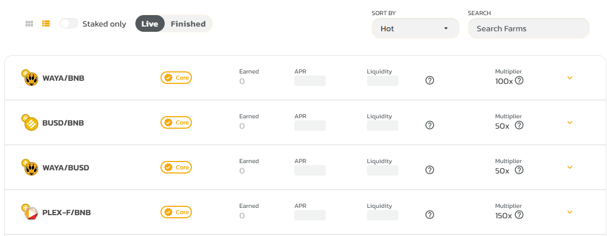

# 📜 Smart Contracts

This page provides links or locations for PlexSwap's smart contracts.

## Main contracts

The following links will take you to the BscScan page for PlexSwap's main smart contracts.

* [PlexSwap: Main Staking Contract/ChiefFarmer](https://bscscan.com/address/0x4Ba4EFa9C4E44b94ea232Fd5F5f7F4A4961904e5)
* [PlexSwap: Main Staking Contract/TaskMaster](https://bscscan.com/address/0x5a30a7CeA5B5e78C7ECb86cEA6EBA50577412B2c)
* [PlexSwap: Factory](https://bscscan.com/address/0x580B12Fcc6247E7bA7a02324Ea6Aa6604d0BEC7A)
* [PlexSwap: Router](https://bscscan.com/address/0x4bAa3F9f24B97aa67B0A0f080bA3A9c994c6AE93)
* Others:
  * [Farms Contracts](./#farms-contracts)

## Farms contracts

Each Farm used by PlexSwap has its own smart contract. Follow the steps below to view a Farm's smart contract.

1. Go to the [PlexSwap Farms page](https://swap.plexfinance.us/farms) and click the row of the Farm you want to see the contract for.

1. When the details section expands out, click the **View Contract** link on the left to open the contract in BscScan.

