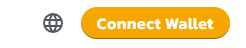
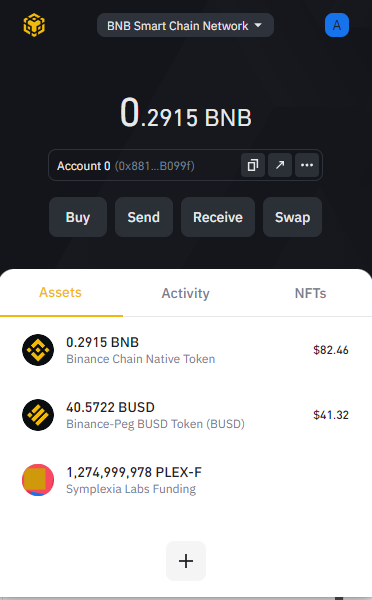
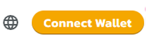
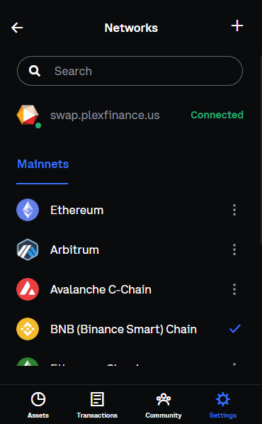

# Connect Your Wallet to PlexSwap

You've made a wallet and gotten your BEP20 tokens, now you just need to connect your wallet with PlexSwap and you're good to go!

Check out the steps below for how to connect each of our recommended wallets to PlexSwap.

## **Desktop/Web Browser Wallets**



 (1) (1) (1) (1) (1) (1) (1) (1) (1) (1) (1) (1) (1) (1) (10).png>)

**Chrome and Firefox**

1. Open MetaMask and click on the **network selector** at the top. By default it will show "Ethereum Mainnet". Scroll down and click **Custom RPC**.\
   .png>)
2. A window will open. Type in the details below.\
   .png>)
3. Make sure you've typed everything in correctly and click **Save**. BNB Smart Chain will now be one of your network options.\
   .png>)
4. Visit the [PlexSwap website](https://swap.plexfinance.us). In the top right corner you'll see the **Connect** button. Click it.\
   
5. A window will appear asking you to choose a wallet to connect to. Click **MetaMask** (it's the top-left option on the list).

.png>)

**Resources**

[**Download MetaMask**](https://metamask.io/download.html) (Automatically detects browser)\
[**MetaMask Setup Guide**](https://academy.binance.com/en/articles/connecting-metamask-to-binance-smart-chain)




**Chrome and Firefox**

1. Open Binance Chain Wallet and click on the network selector at the top. The default network will be Binance Chain. Choose **BNB Smart Chain** from the list.\
   
2. Visit the [PlexSwap website](https://swap.plexfinance.us). In the top right corner you'll see the **Connect** button. Click it.\
   
3. A window will appear asking you to choose a wallet to connect to. Click **Binance Chain Wallet** (it's the top-right option on the list).

.png>)

**Resources**

[**Download Binance Wallet**](https://www.binance.org/en) (Automatically detects browser)\
**Binance Wallet Setup Guide**



 (1) (1) (1) (1) (1) (1) (1) (1) (1) (1) (1) (1) (1) (1) (10) (1).png>)

1. Visit the [PlexSwap website](https://swap.plexfinance.us), In the top right corner you'll see the **Connect** button. Click it.\
   
2. A window will appear asking you to choose a wallet to connect to. Click **Coinbase Wallet** (It's the first of the second line).\
   .png>)
3. Open Coinbase Wallet and click on the **Settings** icon at the top-right. By default it will show "Ethereum Mainnet" as the Default Network. Click on **Binance Smart Chain** to change your **Default Network.**\
   
4. Binance Smart Chain will now be your Default Network.

**Resources**

[**Download Coinbase Wallet**](https://chrome.google.com/webstore/detail/coinbase-wallet-extension/hnfanknocfeofbddgcijnmhnfnkdnaad?hl=en\&authuser=0)(Chrome Only)

[**Coinbase Wallet Setup Guide**](https://www.coinbase.com/wallet/getting-started-extension)




**Remember - NEVER, under any situation, should you ever give someone your private key or recovery phrases.**

